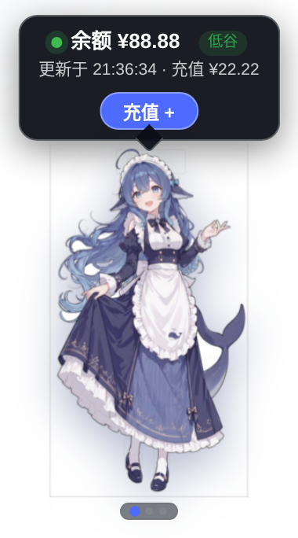

# dsh-whale-pet 🐳

[中文](README.md) · [Installation](docs/INSTALL.md) · [Architecture](docs/ARCHITECTURE.md) · [Changelog](CHANGELOG.md)

`dsh-whale-pet` is a Whale-chan overlay plugin for the DeepSeek Harness Web GUI. It shows account balance and spend, OpenCode Go plan quota, live task progress with per-model completion summaries, and lets you import your own Cubism 3/4/5 Live2D models that replace the default Whale-chan with interactive motions.



> The screenshot uses fixed example data (balance ¥88.88) and contains no real account information.

## v0.4.0 highlights

### Live2D model import and interaction

- Open Live2D settings with the `⚙️` button in the pet's top-right corner.
- Import a `.zip` that contains one `.model3.json` plus its referenced `.moc3`, textures, physics, motions, expressions, etc.; an outer folder is fine.
- Import an HTTP/HTTPS `.model3.json` URL (the asset server must allow browser CORS). Referenced assets are downloaded and the model later restores from the browser's IndexedDB.
- Supports Cubism 3/4/5 `.model3.json`; legacy Cubism 2 `.model.json` is not supported.
- Interactions: mouse movement drives eye/head focus, clicking a hit area plays its same-named motion (commonly `TapBody`), and the settings panel can play a random motion or expression; models also provide idle motions, eye blink, breath, and physics.
- Opening settings with the `⚙️` button does not cycle pages. The settings panel also includes a pet size slider (50%–200%) that scales only the pet model — bubbles and dialogs keep their size — persists the choice, and offers a one-click reset.
- On import failure, incomplete assets, or missing WebGL, the default PNG stays active and the plugin never fails to start; a model can be removed at any time.
- The official Cubism Core is served locally by the plugin via a same-origin route, so the runtime does not depend on an external CDN. The PIXI/Live2D renderer loads only when Live2D is actually used.

> Only import models you are entitled to use. The independent Cubism Core license and source are documented in [ASSET_NOTICE.md](ASSET_NOTICE.md).

### Balance and spend (merged page)

- Host-side balance lookup via `DEEPSEEK_API_KEY`; credentials never reach the browser.
- Balance and today/seven-day spend share one page; amounts are strictly accumulated from account balance decreases.
- Top-ups or grants update the baseline and never reduce accumulated spend; the first successful read establishes a zero-spend baseline.

### OpenCode Go plan quota

- Dedicated page for rolling 5-hour, 7-day, and monthly windows with used, remaining, status, and reset time.
- Credentials resolve from `OPENCODE_GO_API_KEY` first, then the opencode CLI login file `~/.local/share/opencode/auth.json` (`opencode-go.key`); keys stay on the host.
- The host applies a 30-second cache with concurrent coalescing and falls back to the last successful snapshot.

### Tasks and completion dialog

- Up to ten running sessions surface; subagent rows nest under their parent task family and auto-scroll past five rows.
- `approval/asked` turns the status dot yellow; `approval/decided` clears it immediately.
- The completion dialog splits the latest conversation and full-session totals, pricing each message with its actual model and time.

### Whale-chan and refresh

- Draggable pet with saved position, click-to-cycle pages, theme adaptation, peak/off-peak badge, and top-up link.
- Balance/spend refresh every 60 seconds; task progress refreshes more often; OpenCode Go refreshes every 60 seconds while open.

## Install

Requirements: Node.js 20+, a working DSH CLI, and `pnpm` on `PATH`.

Download `dsh-whale-pet-0.4.0.tgz` from [Releases](https://github.com/ali8772/dsh-web-gui/releases):

```sh
dsh plugin --profile web add ./dsh-whale-pet-0.4.0.tgz
```

Restart `dsh web`, then refresh the browser. Do not add a second insertion to the profile patch; the packaged bundle activates itself. See [docs/INSTALL.md](docs/INSTALL.md) for upgrades, removal, and verification.

## Host routes

| Path | Purpose |
|---|---|
| `GET /api/whale-pet/health` | Health probe returning `{ plugin, version, ok }` |
| `GET /api/whale-pet/state` | Balance plus today/seven-day spend and call counts |
| `POST /api/whale-pet/tasks` | Live task progress and awaiting-user state |
| `POST /api/whale-pet/task-summary` | Per-session token and cost summary, priced per model |
| `GET /api/whale-pet/opencode-go` | OpenCode Go plan quota |
| `GET /dsh-whale-pet-live2dcubismcore.min.js` | Local Cubism Core runtime, loaded only when Live2D is used |
| `GET /dsh-whale-pet-live2d.js` | Dynamic PIXI/Live2D renderer |

## Data and privacy

- Credentials always stay on the host; no route returns a raw key.
- The balance ledger at `$DSH_HOME/whale-pet/balance-spend.json` stores only currency, the last observed balance, and per-day accumulated decreases.
- Session logs are used only for call counts, task progress, and per-model pricing.
- Imported Live2D models stay in the current browser's IndexedDB and are not uploaded to the plugin host or third parties. During URL import the browser fetches directly from the model server you enter.
- ZIP extraction is limited to 2,048 files and 256 MiB uncompressed, and rejects absolute URLs/paths and references escaping the archive root.

Never commit credentials, profile files, session logs, real account screenshots, or Live2D models you are not entitled to distribute.

## Verify

```sh
curl http://127.0.0.1:3080/api/whale-pet/health
```

Expected:

```json
{"plugin":"dsh-whale-pet","version":"0.4.0","ok":true}
```

## Windows companions

`windows/` is an experimental PowerShell/WPF companion and `windows-rust/` is an independent Rust experiment; neither is part of the DSH bundle or shipped in the plugin package. See their READMEs.

## Development

```sh
npm ci
npm run build
npm test
npm run check
npm pack --dry-run
```

See [CONTRIBUTING.md](CONTRIBUTING.md), [docs/RELEASE.md](docs/RELEASE.md), and [ASSET_NOTICE.md](ASSET_NOTICE.md).

## License

Project code is [MIT](LICENSE). Artwork, the separate Live2D Cubism Core license, and trademark notices are in [ASSET_NOTICE.md](ASSET_NOTICE.md). This project is not affiliated with or endorsed by DeepSeek or Live2D Inc.